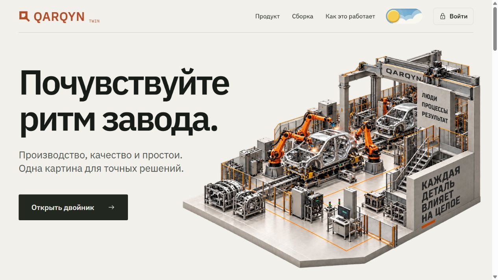
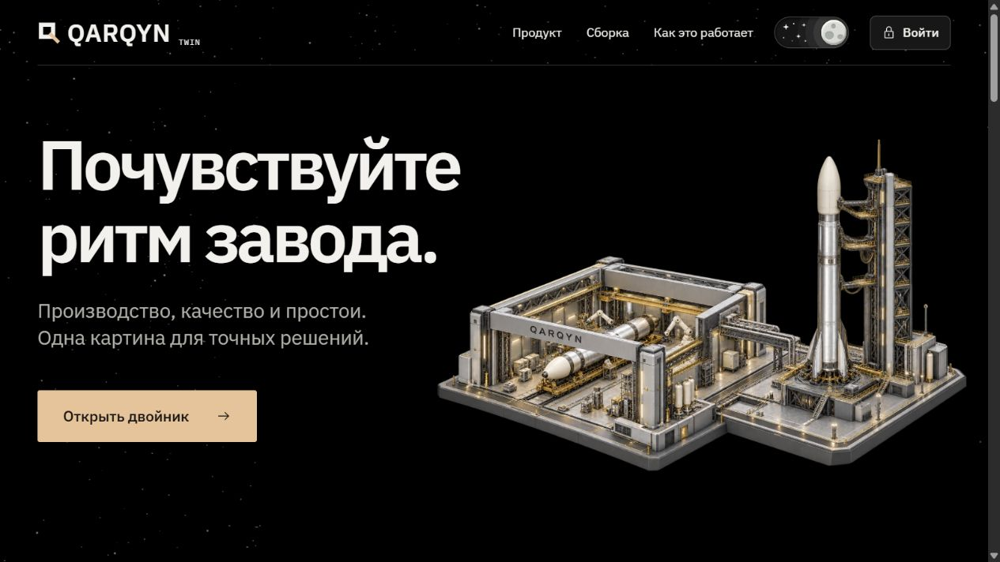
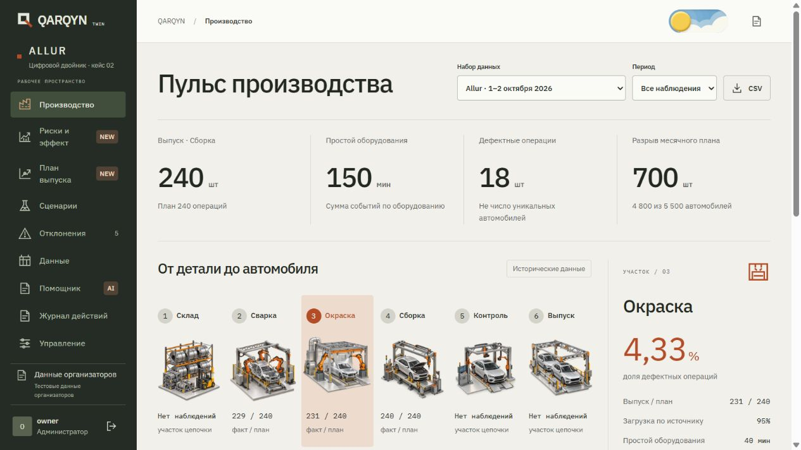
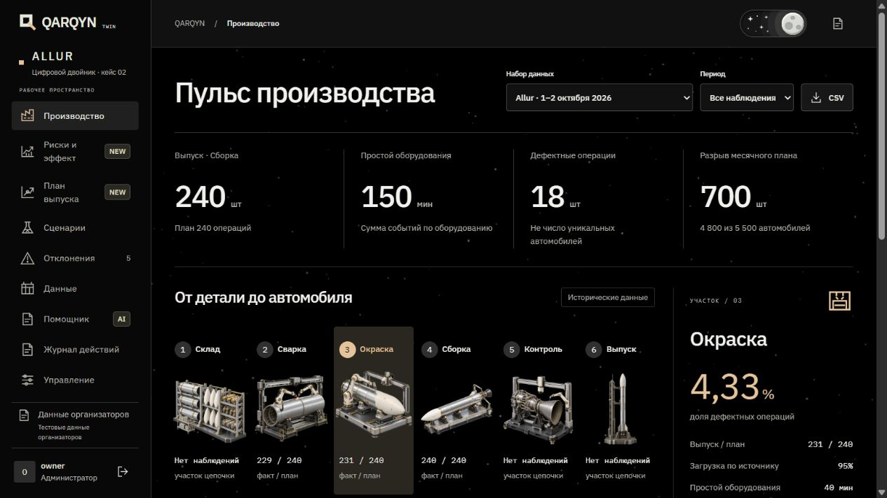
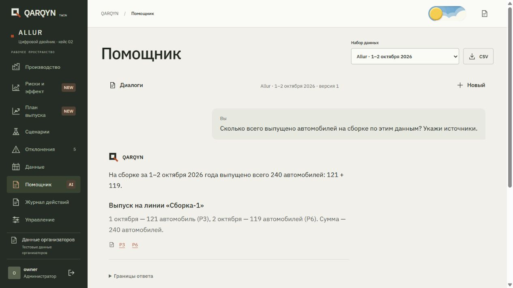
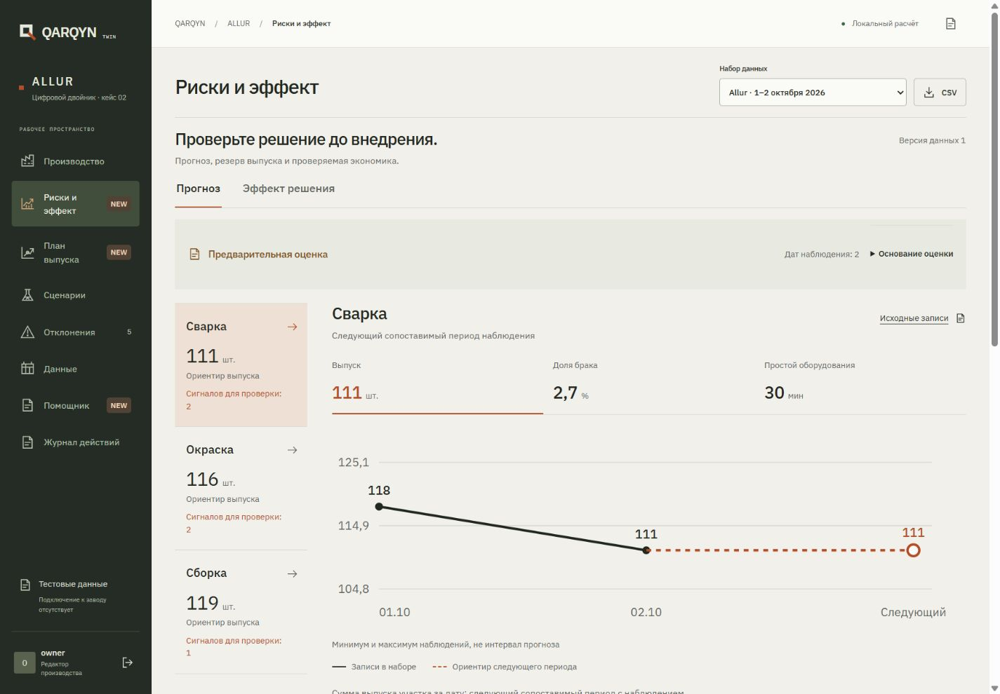
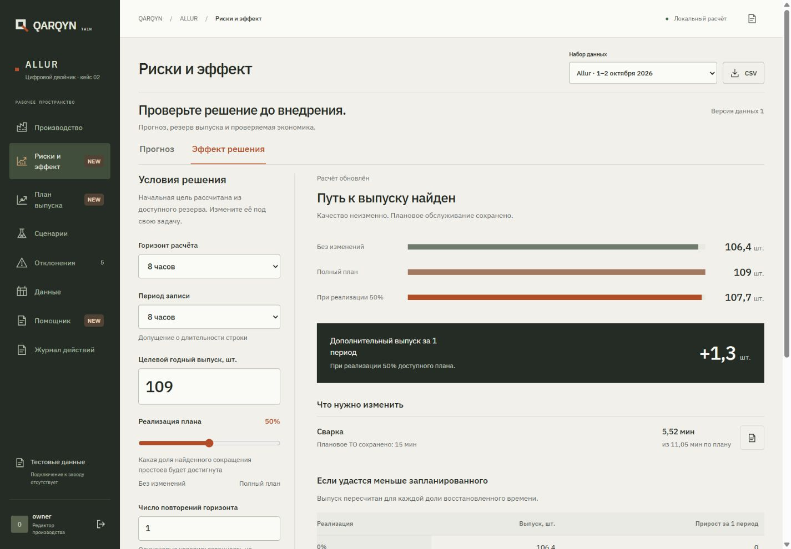
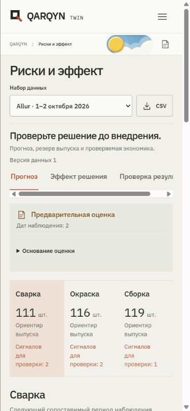
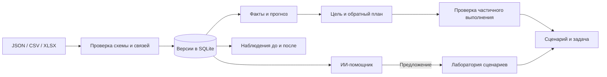

<a id="top"></a>

<p align="center"></p>

<p align="center">Цифровой двойник производственного потока.<br>От записи о потере до решения, которое можно проверить.</p>

<p align="center"><a href="https://github.com/AQADIL/qarqyn-twin/actions/workflows/ci.yml"></a></p>

<p align="center">
  <a href="#product">Продукт</a> ·
  <a href="#mechanism">Как работает</a> ·
  <a href="docs/submission/QARQYN-pitch.pdf">Презентация</a> ·
  <a href="docs/submission/pitch-and-qa.md">Pitch &amp; Q&amp;A</a> ·
  <a href="#start">Запуск</a> ·
  <a href="#data">Данные</a> ·
  <a href="#engineering">Инженерная часть</a> ·
  <a href="#team">Команда</a>
</p>

**Allur · кейс № 2 · Qostanai AI Industry Hackathon 2026**

QARQYN помогает инженеру найти потери, оценить следующий период и проверить, какое изменение даст результат всей производственной цепочке. Показатели связаны с исходными записями. Сценарии пересчитывает сервер. Предложение ИИ можно изменить, проверить и сохранить вместе с версией данных.

Рабочий прототип использует тестовые таблицы организаторов. На этих данных можно воспроизвести расчёты; они не подтверждают точность прогноза на действующем заводе.

> **Начните с решения.** Поставьте цель 109 единиц, получите план восстановления времени, уменьшите его реализацию до 50% и проверьте, как выпуск меняется до 107,7. Каждый результат связан с версией исходных данных.

### Три минуты внутри продукта

[Презентация PDF · 6 слайдов](docs/submission/QARQYN-pitch.pdf) · [HTML для показа офлайн](docs/submission/QARQYN-pitch.html) · [Реплики на 3 минуты](docs/submission/presentation-notes.md)

| Шаг | Откройте | Проверьте сами |
| --- | --- | --- |
| **01 · Найти потерю** | Производство → участок → источники | Откуда взялся показатель и какие записи его формируют |
| **02 · Найти действие** | План выпуска → цель 109 → горизонт 8 часов | 11,0575 минуты восстановления на сварке при защищённом плановом ТО |
| **03 · Испытать решение** | Риски и эффект → Эффект решения → реализация 50% | 107,7 единицы вместо полного плана 109; экономика появляется только с вашими условиями |
| **04 · Передать в работу** | Сохранить сценарий → Создать задачу | Версия данных, ответственный, срок и проверяемый результат |

Для воспроизведения выберите исходный набор Allur и все наблюдения, задайте 8 часов на исходный период. Сохранение сценариев и задач доступно после входа редактором или владельцем. Для изменения исходных таблиц сначала создайте рабочую копию.

[Текст защиты и ответы жюри →](docs/submission/pitch-and-qa.md) · [Запустить у себя →](#start) · [Проверенные возможности и ограничения →](docs/readiness.md)

<a id="product"></a>

## Производство, которое можно исследовать

### Главная: два визуальных мира

| Светлая тема · автомобильный завод | Тёмная тема · космический комплекс |
| :---: | :---: |
| [](docs/assets/landing-light.png) | [](docs/assets/landing-dark.png) |

### Производство: одна система, два оформления

| Светлая тема · автомобильные участки | Тёмная тема · ракетные участки |
| :---: | :---: |
| [](docs/assets/overview-light.png) | [](docs/assets/overview-dark.png) |

Нажмите на любой снимок, чтобы рассмотреть его в полном размере. При переключении темы меняются иллюстрации и оформление; производственные данные и расчёты остаются теми же.

| Рабочий вопрос                                        | Инструмент QARQYN               | Что получает инженер                                                                            |
| ----------------------------------------------------- | ------------------------------- | ----------------------------------------------------------------------------------------------- |
| Где теряется выпуск?                                  | Производство                    | План и факт, качество, загрузка и простои с переходом к исходной записи                         |
| Что ожидается в следующем периоде?                    | Риски и эффект → Прогноз        | Оценка выпуска, брака и зарегистрированного простоя; метод, история и доступная проверка ошибки |
| Как достичь заданного выпуска?                        | План выпуска                    | Минимальное восстановление времени при текущем качестве или объяснение недостижимости           |
| Что будет, если удастся выполнить только часть плана? | Риски и эффект → Эффект решения | Пересчёт всей цепочки при выбранной доле восстановленного времени                               |
| Оправданы ли затраты?                                 | Расчёт эффекта                  | Дополнительный выпуск, маржинальный доход и покрытие затрат по введённым пользователем условиям |
| Как проверить предложение ИИ?                         | Помощник                        | Диалог, ссылки на записи, редактируемый сценарий и независимый серверный пересчёт               |
| Как работать со своими данными?                       | Данные и отклонения             | Импорт JSON/CSV/XLSX, версии данных, редактирование, задачи и журнал действий                   |

Интерфейс адаптирован для компьютера и телефона. Космическая тема использует чёрный фон, звёздное поле Three.js и семь иллюстраций ракетных участков. Движение учитывает системную настройку reduced motion и останавливается в скрытой вкладке; при недоступном WebGL остаётся статический фон. Светлая тема доступна одним нажатием, выбор сохраняется. На главной используется связанная с прокруткой анимация сборки; на компьютере и телефоне видео управляется прокруткой без плеера; при системном ограничении движения показан неподвижный кадр. Иллюстрации участков плавно меняются вместе с темой; собственные SVG-иконки объединяют главную и рабочее пространство. [Как созданы космические иллюстрации →](docs/cosmic-assets.md)

<details>
<summary><strong>Посмотреть анимацию сборки</strong></summary>

<p align="center"></p>

Здесь показан зацикленный предпросмотр. На сайте движение вперёд и назад управляется прокруткой. Это иллюстрация сборки, а не физическая симуляция производственного процесса.

</details>

### Рабочий процесс без потерянного контекста

- **Диалог продолжается после перезагрузки.** История хранится на сервере, поддерживает поиск, переименование, копирование ответа и отмену запроса. Источники открываются в версии, на которой получен ответ.
- **От риска к действию.** Открывайте план, сценарий, расчёт эффекта и задачу с выбранным набором и участком. Для задачи задаются ответственный, срок и результат.
- **Ваши таблицы.** Импортируйте JSON, CSV или XLSX с сопоставлением колонок и предпросмотром ошибок. Версии данных и исторические сценарии можно открыть и сравнить.
- **Контроль владельца.** Отдельный раздел управления доступом, резервными копиями, состоянием базы и обслуживанием.



<a id="mechanism"></a>

## От цели к проверяемому решению

**Обратное планирование.** Инженер задаёт нужный выпуск. Модель находит необходимое восстановление времени каждого участка. Плановые и неклассифицированные события исключаются из доступного восстановления. Несовместимые даты, линии, периоды или неполное качество блокируют расчёт с объяснением. Если цель недостижима, система показывает предел.

**Прогноз с проверкой собственной ошибки.** При короткой истории используется последнее наблюдение. Когда данных достаточно, сравниваются последнее значение, среднее последних трёх периодов и локальный линейный тренд. На каждом шаге выбор использует только прошлые ошибки. После заданной смены линии, длительности периода или режима прогноз начинается с сопоставимой истории. Диагностика показывает покрытие наблюдений, прошлое покрытие диапазонов и рост недавних ошибок.

**Проверка устойчивости эффекта.** Доля реализации меняет восстановленные минуты, после чего рассчитываются все ограничения цепочки. Денежные показатели появляются после ввода маржинального вклада и затрат. Можно дополнительно ограничить продажи и учесть регулярные расходы: непроданный выпуск не превращается в доход.

**Наблюдения до и после.** Проверка пилота сравнивает реальные выбранные даты: выпуск на период, выпуск на рабочий час, качество и простой при полном журнале. Она проверяет линию, длительность периода и режим, сохраняет ссылки на записи. При неизвестной сопоставимости показывает факты и причину отсутствия сравнимой разницы. Измеренная разница сама по себе не доказывает причинный эффект внедрения.

**Проверяемый ИИ.** Помощник получает факты, ограничения и предварительный прогноз. Его предложение проходит проверку структуры, источников и допустимого восстановления времени. Численный результат формирует локальная модель. Сохранение требует действия пользователя.

**Расчёт, который можно передать коллеге.** Кнопка «Скачать расчёт» сохраняет JSON с введёнными условиями, версией данных, найденным планом и результатом проверки эффекта. Решение можно обсуждать вместе с его исходными допущениями.



<details>
<summary><strong>Посмотреть проверку частично выполненного плана</strong></summary>

Цель — 109 единиц за 8 часов. При реализации половины найденного восстановления расчёт даёт 107,7. Плановое обслуживание остаётся защищённым.



</details>

<details>
<summary><strong>Рабочее пространство на телефоне</strong></summary>

Выбор набора и участков, показатели и доступ к основаниям оценки сохраняются на узком экране.

<p align="center"></p>

</details>

### Пример, который воспроизводится из репозитория

Для исходного набора, горизонта **8 часов** и допущения **8 часов на исходную строку**:

| Условие                                         |                            Расчёт |
| ----------------------------------------------- | --------------------------------: |
| Базовый годный поток                            |                  106,4000 единицы |
| Целевой выпуск                                  |                        109 единиц |
| Необходимое восстановление на сварке            | 11,0575 минуты на исходный период |
| Предел при неизменном качестве и сохранённом ТО |                  109,3392 единицы |
| Реализована половина найденного восстановления  |                  107,7000 единицы |
| Цель 110 при тех же ограничениях                |                       Недостижима |

Это результат модели потока v3 и обратного плана v2, а не измеренный прирост завода. Внутренний расчёт использует неокруглённые доли брака; в таблице округлён только вывод. Длительность исходного периода задаётся явно. [Формулы, точные значения и проверка минимальности →](docs/target-planning.md)

<a id="start"></a>

## Запуск из чистого клона

Нужен **Node.js 22.13+** и npm. Приложение и API запускаются одним процессом; отдельная СУБД не требуется.

```bash
git clone https://github.com/AQADIL/qarqyn-twin.git
cd qarqyn-twin
npm ci
npm run setup
npm run dev
```

Откройте адрес из строки `QARQYN running at …` в терминале. Настройка выбирает свободный локальный порт, создаёт `.env` и случайный пароль владельца. Существующий `.env` сохраняется.

- **Гостевой вход:** просмотр исходного набора и локальные расчёты без пароля.
- **Вход владельца:** значения `ADMIN_USERNAME` и `ADMIN_PASSWORD` из локального `.env`. Пароль не публикуется в репозитории.
- **Смена доступа:** измените параметры владельца в `.env` и перезапустите сервер. Учётная запись обновится, её старые сессии завершатся.

В Node.js 22 встроенный `node:sqlite` может выводить предупреждение об экспериментальном статусе.

### Проверка и production-сборка

```bash
npm run check
npm start
```

`check` запускает тесты и создаёт `dist`. `start` обслуживает собранный клиент и API. Отдельная сборка доступна через `npm run build`, отдельные тесты через `npm test`.

При каждом push и pull request [GitHub Actions](https://github.com/AQADIL/qarqyn-twin/actions/workflows/ci.yml) повторяет установку, тесты и сборку на Linux с Node.js 22. Отдельная матрица проверяет рабочие сценарии в Chromium, Firefox и WebKit на изолированной временной базе. Ключ провайдера для этих проверок не нужен. Для локального браузерного прогона после сборки выполните `npx playwright install` и `npm run test:e2e`.

Для внешнего размещения задайте `HOST`, `PORT`, `APP_ORIGIN` и `DATABASE_PATH` в окружении. Публичный production origin должен использовать HTTPS; reverse proxy должен сохранять ожидаемый `Host`. Базе нужен постоянный диск. Настройте резервное копирование SQLite и проверьте восстановление. Архитектура рассчитана на один экземпляр приложения.

### Необязательный ИИ-помощник

Добавьте ключ в `AI_API_KEY` серверного `.env` и перезапустите приложение. Остальные параметры перечислены в [.env.example](.env.example):

| Параметры                                                   | Назначение                                                                               |
| ----------------------------------------------------------- | ---------------------------------------------------------------------------------------- |
| `AI_BASE_URL`, `AI_MODEL`, `AI_REASONING`                   | Провайдер, доступная вашему API-проекту модель и глубина рассуждения; в примере `medium` |
| `AI_TIMEOUT_MS`, `AI_MAX_OUTPUT_TOKENS`                     | Время ожидания и предел длины ответа                                                     |
| `AI_BUDGET_USD`                                             | Внутренний предел расходов этого экземпляра                                              |
| `AI_INPUT_PRICE_PER_MILLION`, `AI_OUTPUT_PRICE_PER_MILLION` | Тарифы для локального учёта, которые задаёт владелец                                     |

Без ключа работают обзор, прогноз, сценарии, обратное планирование, расчёт эффекта и операции с данными. Внешний ИИ доступен редактору и администратору. Вопрос, ограниченная история диалога, сводка и записи выбранного набора передаются провайдеру. `store: false` задаётся в запросе; отправку конфиденциальных данных необходимо согласовать с владельцем данных.

Ключи остаются на сервере. Не помещайте их в `VITE_*`, клиентский код или Git. `.env` и `runtime/` исключены из отслеживания. Локальный бюджет не является балансом аккаунта провайдера; повторный платный запрос не запускается автоматически после таймаута.

<a id="data"></a>

## Что означают цифры

| Тип результата       | Источник                                      | Граница интерпретации                                                              |
| -------------------- | --------------------------------------------- | ---------------------------------------------------------------------------------- |
| Наблюдение           | Таблицы организаторов или импорт пользователя | Факт в выбранном наборе, не подтверждение подключения к заводу                     |
| Прогноз              | Статистическое продолжение истории            | Следующий сопоставимый наблюдаемый период; точность зависит от истории и режима    |
| Сценарий             | Последовательная модель потока                | Условный выпуск при выбранных параметрах                                           |
| Экономический эффект | Сценарий и введённые пользователем суммы      | Расчёт при этих допущениях, не заявленная экономия Allur                           |
| Сравнение до/после   | Выбранные реальные даты одного участка        | Описательная разница при проверенной сопоставимости, не доказательство причинности |

[Исходный набор](data/allur.json) содержит **две даты**, 6 производственных записей, 6 записей качества, 4 простоя и 3 месячных плана. Проверяемые итоги: **240 операций сборки**, **18 дефектных операций**, **150 минут простоев оборудования**, месячный план **4800** при цели **5500**. Выпуск разных участков не складывается в число готовых автомобилей; сумма остановок машин не равна простою завода.

Две даты позволяют показать предварительный прогноз, но не доказать его точность. Минимум 8 наблюдений одного показателя нужен для первых пяти отложенных проверок и выбора метода. Это технический порог, не сертификат надёжности. До 20 проверок вместо интервала прогноза показывается диапазон прошлых наблюдений. После этого доступен диапазон по прошлым ошибкам, без гарантии покрытия будущего.

Журнал простоев содержит события. Нулевой простой можно добавить в ряд только при явном подтверждении полноты журнала за дату. Без него пропуск остаётся неизвестным, а прогноз минут условен на наличие записи. Вероятность аварии не рассчитывается. OEE не рассчитывается без идеального цикла и согласованной базы времени.

Рабочая копия поддерживает метаданные `periodHours`, `regime`, классификацию простоев `planned / unplanned / unknown` и подтверждение `observationCoverage`. Исходные данные организаторов сохранены без придуманных уточнений. Подключения к MES/PLC, обученного предсказателя отказов и подтверждённого промышленного пилота нет; инструмент сравнения до/после подготовлен для будущих реальных наблюдений.

<a id="engineering"></a>

## Инженерная часть

| Слой      | Реализация                                                                                   |
| --------- | -------------------------------------------------------------------------------------------- |
| Интерфейс | React 19, Vite 8, Motion, Three.js, IBM Plex, собственные SVG-иконки                         |
| API       | Express 5, Zod, Helmet, ограничения частоты и размера запросов                               |
| Хранение  | Встроенный `node:sqlite`, WAL, версии записей, журнал изменений                              |
| Расчёты   | Локальные модули аналитики, прогноза, обратного планирования и эффекта                       |
| Помощник  | OpenAI Responses API, строгая структура ответа, проверка источников и пересчёт сценария      |
| Проверки  | Node.js test runner: формулы, границы, причинность прогноза, API, права и сохранность данных |

Роли `viewer`, `editor`, `admin` проверяются сервером. Гость не меняет данные и не вызывает платный ИИ. Исходный набор защищён, изменения рабочих наборов проверяются по владельцу и версии. Пароли хешируются scrypt, токены сессий хранятся в виде хешей. POST/PUT/DELETE защищены проверками Origin и CSRF; CSP ограничивает источники клиента. Несовпадение версии возвращает `409`, недопустимый расчёт `422`.

Тесты включают ручные контрольные примеры, отсутствие утечки будущего в прогноз, пропуски данных, недостижимые цели, защиту планового ТО, финансовые границы, изоляцию чужих наборов и ротацию учётных данных. Ответы провайдера в автоматических тестах заданы явно внутри тестового процесса; они не подменяют реальные ответы приложения.

Подробнее: [архитектура и API](docs/architecture.md) · [обратное планирование](docs/target-planning.md) · [проверки](docs/backend-review.md) · [эксплуатация](docs/operations.md) · [состояние 50 замечаний и границы готовности](docs/readiness.md).

<details>
<summary><strong>Как данные проходят через систему</strong></summary>



Языковая модель объясняет и предлагает. Числа пересчитываются сервером, сохранение выполняет пользователь, действия попадают в журнал.

</details>

### Путеводитель по репозиторию

| Если вы хотите… | Откройте |
| --- | --- |
| Провести защиту и подготовиться к вопросам | [Pitch & Q&A](docs/submission/pitch-and-qa.md) |
| Проверить формулы и воспроизвести пример | [Обратное планирование](docs/target-planning.md) |
| Разобраться в API и устройстве приложения | [Архитектура](docs/architecture.md) |
| Проверить тесты и границы их доказательности | [Техническая проверка](docs/backend-review.md) |
| Развернуть сервер, настроить доступ и резервные копии | [Эксплуатация](docs/operations.md) |
| Увидеть, что готово и что требует пилота | [Карта готовности](docs/readiness.md) |
| Изучить происхождение космических иллюстраций | [Визуальные материалы](docs/cosmic-assets.md) |

## Источники и внешние компоненты

- [Условия кейса № 2 Allur](https://drive.google.com/file/d/1VQM_DD7e4ecX8FRukZEB35kOjtetoHQB/view), [данные организаторов](https://docs.google.com/document/d/1HKx1j3UIkkIZknEoKKMEQBksqWpYpaW5/edit), [материалы хакатона](https://drive.google.com/drive/folders/1Xx-QKkGMSk2Df6X9jIH2TbpQxZI_zaV1).
- Статистические принципы: [простые прогнозы](https://otexts.com/fpp3/simple-methods.html), [проверка по времени](https://otexts.com/fpp3/tscv.html), [неопределённость прогноза](https://otexts.com/fpp3/prediction-intervals.html). Конкретные окна и технические пороги реализации описаны в коде и документации.
- **Codex:** помощь в разработке, проверке кода и подготовке материалов. **OpenAI image generation:** промышленные иллюстрации и визуальные материалы. **Gemini:** предоставленное пользователем видео сборки, обработанное для веб-страницы с FFmpeg и rembg. Эти изображения и видео не являются съёмкой завода Allur.
- **OpenAI Responses API:** текстовые ответы инженерного помощника. Расчётные показатели формируются локальным кодом; обязательного внешнего ИИ для основной работы нет.
- Библиотеки и версии закреплены в [package-lock.json](package-lock.json). Шрифты IBM Plex поставляются локально через npm-пакеты и распространяются по SIL Open Font License.

<a id="team"></a>

## Команда

**Astana IT University · Астана**

| Участник | GitHub | Роль в команде |
| --- | --- | --- |
| Әліш Ақәділ | [@AQADIL](https://github.com/AQADIL) | Капитан |
| Төртқара Ерасыл | [@Erasy09](https://github.com/Erasy09) | Участник |

[Участники репозитория](https://github.com/AQADIL/qarqyn-twin/graphs/contributors) · [История изменений](https://github.com/AQADIL/qarqyn-twin/commits/main) · [↑ К началу](#top)
