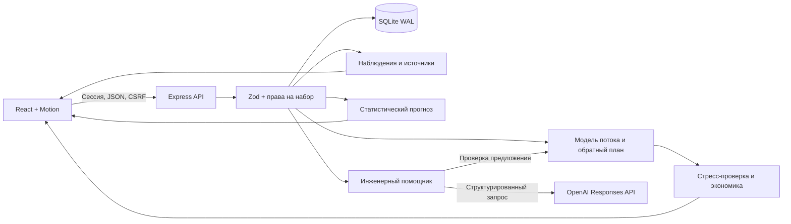

# Архитектура QARQYN

## Один сервер, проверяемые расчёты

React 19 и Motion формируют интерфейс. Vite собирает клиент, Express 5 обслуживает API и production-сборку. Node.js выполняет расчёты, SQLite хранит данные и состояние приложения. Вызов OpenAI необязателен для аналитики, прогноза, сценариев и расчёта эффекта.



| Модуль                | Ответственность                                                                |
| --------------------- | ------------------------------------------------------------------------------ |
| `server/schema.js`    | Схемы набора, записей и запросов; ограничения ссылок и чисел                   |
| `server/analytics.js` | Наблюдения, отклонения, лимиты восстановления, прямой и обратный расчёт потока |
| `server/forecast.js`  | Временные ряды, причинная проверка методов, предварительные риски              |
| `server/impact.js`    | Частичная реализация плана, дополнительный выпуск и введённая экономика        |
| `server/ai.js`        | Контекст, Responses API, проверка результата, лимиты запросов и бюджета        |
| `server/app.js`       | Авторизация, API, принадлежность данных, версии, аудит                         |
| `server/db.js`        | SQLite, схема хранения, хеширование и ротация владельца                        |
| `server/index.js`     | Конфигурация окружения и запуск одного HTTP-процесса                           |

## Данные и происхождение результата

`data/allur.json` содержит нормализованные таблицы организаторов. ID сохраняют тип записи: P — производство, Q — качество, D — простой, M — месячный план. Набор содержит имя источника и SHA-256. Базовый набор защищён от изменения и удаления через API; редактор импортирует или создаёт рабочую копию через интерфейс.

SQLite хранит набор как проверенный JSON с целочисленной версией. Изменение и удаление требуют текущую версию. Конфликт возвращает `409`. Сохранённый сценарий содержит параметры, пересчитанный результат, версию и хеш набора. Это снимок: правка исходных данных не переписывает старый результат незаметно.

Для участка выпуск, план, рабочие часы, дефекты и простой суммируются по соответствующим записям. Доля брака равна сумме дефектов, делённой на сумму проверенных операций. Выпуск разных участков не складывается в число автомобилей. Отсутствие наблюдений последнего производственного участка оставляет итог неизвестным.

Две даты организаторов дают 240 операций сборки, 18 дефектных операций и 150 минут простоев отдельных машин. Окраска: 10 / 231 = 4,33% брака. Месячный план равен 4800 при цели 5500. Это факты тестового набора, не телеметрия действующего предприятия.

## Стационарная последовательная модель v2

`simulate` возвращает обозначение «Последовательная модель потока v2»: новая версия исключает плановое ТО из восстановления и требует наблюдения качества. Ранее сохранённые сценарии v1 остаются неизменными снимками прежнего расчёта; для сравнения с новыми условиями их следует пересчитать.

Для каждого измеренного производственного участка:

```text
скорость = суммарный выпуск / суммарные рабочие часы
простой на период = сумма минут / число производственных наблюдений
доступное время = горизонт × max(0, 1 − (простой − восстановление) / минуты исходного периода)
ёмкость = скорость × доступное время
годный выход = min(входящий поток, ёмкость) × (1 − брак / 100)
```

Длительность периода исходной строки задаётся пользователем. В примерах используется 8 часов: вводные упоминают двухсменную работу, а отдельные строки содержат до 8 рабочих часов, поэтому длительность строки нельзя незаметно принять за сутки.

Наблюдения качества нужны для каждого производственного участка. Иначе расчёт отклоняется с `422`; отсутствие качества не считается нулевым браком. `recoveryLimits` исключает строки с явно указанной причиной «Плановое ТО» из доступного восстановления. Ограничение действует в лаборатории, автоматическом сравнении, обратном плане и предложениях ИИ. Неизвестные виды обслуживания не классифицируются автоматически.

При исходном наборе, горизонте 8 часов и периоде 8 часов базовый поток равен **106,40**. Возврат **12,5 минуты сварки** и целевой брак сварки **2%** дают **109,54**, изменение **+3,14**. Плановое ТО сохранено. Это условный расчёт потока, не подтверждённое увеличение выручки или выпуска.

Модель не включает начальные запасы, очереди, передел, транспортные задержки, разгон, параллельные линии и идентичность автомобилей. Суммарный простой оборудования условно принят потерей времени участка; пересечение остановок неизвестно. Скорость уже получена из исторических данных, поэтому нормализацию и влияние остановок нужно сверить с технологом. Чувствительность к интервалам Уилсона для брака не является доверительным интервалом выпуска.

## Обратный план и эффект

`planTarget` находит покомпонентный минимум восстановления времени при фиксированных скорости и качестве. Достижимость проверяется без преждевременного округления. На исходных данных цель **109** требует **11,0462 минуты сварки**; цель **110** выше предела **109,3419**. [Формулы, контракт и ограничения](target-planning.md).

`evaluateImpact` получает этот план и умножает найденные минуты на выбранную пользователем долю реализации. Затем заново считает ограничения каждого участка и итоговый минимум. Доля реализации — сценарное допущение, не вероятность успеха. Результат дополнительно рассчитывается для 0%, 25%, 50%, 75% и 100% реализации.

```text
дополнительные единицы = max(0, новый выпуск − базовый выпуск) × число периодов
дополнительный маржинальный доход = дополнительные единицы × вклад единицы
эффект после затрат = дополнительный маржинальный доход − стоимость внедрения
```

Вклад единицы и стоимость вводит пользователь. Без обоих значений денежный результат остаётся `null`; недостижимая цель также не получает расчётную выгоду. Безубыточность учитывает нулевую маржу, отсутствие прироста и нулевые затраты. Постоянство режима и спроса на протяжении выбранных периодов — допущение. Налоги, дисконтирование и новые регулярные расходы не моделируются.

Экспорт расчёта эффекта сохраняет JSON с входными условиями, версией набора и результатом. Он блокируется при ошибке, недопустимом вводе или незавершённом пересчёте, чтобы не выгрузить результат от прежних значений.

## Статистический прогноз

Данные группируются по датам отдельно для участка и показателя. Выпуск и зарегистрированные минуты суммируются; качество взвешивается по числу проверенных операций. Пропуски не заполняются нулями. Следующий период означает следующее сопоставимое наблюдение, а не автоматически завтрашний день.

Кандидаты: последнее значение, среднее последних трёх наблюдений и линейная экстраполяция последних пяти. Первые три наблюдения используются как начальная история. После пяти последовательных отложенных ошибок можно выбрать метод с меньшей MAE. До этого применяется последнее наблюдение; опубликованная MAE остаётся неизвестной.

Для каждого проверочного шага выбор метода использует ошибки только более ранних шагов. Текущая истинная величина добавляется в оценку методов после фиксации прогноза. Итоговая MAE оценивает всю эту причинную процедуру выбора, а не только лучшего кандидата, выбранного с учётом будущего. Базовый метод проверяется на тех же шагах. Первое сравнение требует минимум 8 наблюдений показателя; этого недостаточно для заявления о промышленной надёжности.

При менее чем 20 проверочных ошибках показываются минимум и максимум наблюдений с соответствующей подписью. Позже доступен симметричный диапазон по 90-му процентилю абсолютной ошибки. Он описывает прошлые ошибки и не гарантирует будущую вероятность покрытия. Доля брака ограничена 0–100%, значения выпуска и минут неотрицательны.

Ответ содержит полную статистику, источники, до 180 последних точек и до 80 последних проверочных шагов с явными признаками усечения. API кеширует до 24 результатов по ID и версии набора; права проверяются до обращения к кешу.

Журнал простоев не содержит подтверждения периодов без событий. Поэтому прогноз минут условен для периода с зарегистрированным событием. Он не определяет вероятность отказа или суммарный простой линии. На двух исходных датах результат предварительный, подтверждённая точность отсутствует.

Методологическая основа: [простые методы](https://otexts.com/fpp3/simple-methods.html), [rolling-origin](https://otexts.com/fpp3/tscv.html), [интервалы](https://otexts.com/fpp3/prediction-intervals.html). Размеры окон и технические пороги — явные настройки этой реализации.

## Инженерный помощник

Контекст включает вопрос, ограниченную историю диалога, проверенные записи, наблюдения, допустимое восстановление и компактную сводку прогноза. OpenAI возвращает JSON по строгой схеме. Сервер проверяет ID источников, участки, лимиты времени и структуру, затем самостоятельно пересчитывает сценарий. Ответ не выполняет SQL, команды или изменения данных.

История диалога передаётся как недоверенный контекст. Существующий ID подтверждает наличие записи, но не истинность каждой фразы модели. Сохранение результата требует действия пользователя и проверки актуальности версии набора. Вопрос и данные выбранного набора передаются внешнему провайдеру с `store: false`; политика обращения с реальными конфиденциальными данными согласуется до интеграции.

На пользователя разрешён один одновременный ИИ-запрос. До отправки резервируется консервативная стоимость; после ответа учитываются токены по настроенным тарифам. Таймаут не запускает автоматический платный повтор. Внутренний бюджет не равен балансу OpenAI.

## API

Все маршруты имеют префикс `/api`. Кроме health и начала сессии требуется действующая сессия. Для POST/PUT/DELETE проверяются Origin, JSON и CSRF; вход и гостевой вход исключены из требования уже существующего CSRF.

| Маршрут                               | Назначение                        | Дополнительные условия                                |
| ------------------------------------- | --------------------------------- | ----------------------------------------------------- |
| `GET /health`                         | Проверка процесса                 | Без сессии                                            |
| `POST /auth/demo`, `POST /auth/login` | Гостевой вход / вход владельца    | Ограничение частоты                                   |
| `GET /session`, `POST /auth/logout`   | Состояние / завершение сессии     | Действующая сессия                                    |
| `GET /datasets`, `GET /datasets/:id`  | Наборы и содержимое               | Права на набор                                        |
| `POST /datasets`                      | Импорт или рабочая копия          | Редактор/администратор                                |
| `PUT`, `DELETE /datasets/:id`         | Изменение / удаление              | Роль, принадлежность, версия; исходный набор защищён  |
| `GET /analysis/:id`                   | Показатели и исходные записи      | Права на набор; необязательная дата                   |
| `GET /forecast/:id`                   | Статистический прогноз и проверка | Права на набор                                        |
| `POST /simulate`, `POST /optimize`    | Прямой расчёт / сравнение         | Права на набор; границы восстановления                |
| `POST /plan-target`                   | Обратное планирование             | Права на набор; 30 запросов в минуту                  |
| `POST /impact`                        | Частичная реализация и экономика  | Права на набор; `expectedDatasetVersion` обязателен   |
| `GET`, `POST /incidents`              | Список / создание событий         | Чтение в своей области, запись по роли                |
| `PUT`, `DELETE /incidents/:id`        | Изменение / удаление события      | Принадлежность и версия                               |
| `GET`, `POST /scenarios`              | Список / сохранение сценариев     | Чтение в своей области, запись по роли                |
| `PUT`, `DELETE /scenarios/:id`        | Изменение / удаление сценария     | Принадлежность и версия                               |
| `GET /export/:id`                     | CSV показателей                   | Права на набор                                        |
| `GET /audit`                          | Журнал изменений                  | Администратор                                         |
| `POST /assistant`                     | Внешний ИИ                        | Редактор/администратор, настроенный провайдер, лимиты |

## Защита и эксплуатация

Пароли хешируются scrypt с индивидуальной солью. Cookie имеет HttpOnly, SameSite=Strict и Secure при HTTPS; в базе хранится хеш токена. При смене параметров владельца в окружении и перезапуске учётная запись обновляется, прежние сессии владельца удаляются, событие попадает в аудит.

API проверяет Host, Origin, CSRF, роль и принадлежность. Zod отклоняет неожиданные поля, неверные даты, ссылки и значения. SQL использует подготовленные параметры; динамические имена таблиц выбираются из фиксированного списка. CSP ограничивает внешние источники. CSV экранирует формульные префиксы. Ошибка сервера не отдаёт стек клиенту.

Перед промышленным размещением нужны корпоративная схема доступа и управления пользователями, проверенные интеграции, HTTPS, резервное копирование с проверкой восстановления, централизованный мониторинг, политика хранения данных и нагрузочное испытание. Система не отправляет команды оборудованию.

## Как проверить внедрение

1. Согласовать определения периода, выпуска и дефекта, полноту журналов, маршруты и взаимное перекрытие остановок.
2. Загрузить реальную историю; сравнить причинную ошибку прогноза с базовым методом по участкам и режимам.
3. До изменения процесса зафиксировать цель, допустимые вмешательства, затраты и способ измерения результата.
4. Выполнить контролируемый пилот с технологом, сопоставить сопоставимые периоды и отдельно учесть спрос, смену моделей и другие изменения.
5. Сопоставить измеренный результат с расчётом; только после этого заявлять производственный и финансовый эффект.

Источник требований: [кейс № 2 Allur](https://drive.google.com/file/d/1VQM_DD7e4ecX8FRukZEB35kOjtetoHQB/view). Данные: [материалы организаторов](https://docs.google.com/document/d/1HKx1j3UIkkIZknEoKKMEQBksqWpYpaW5/edit).
