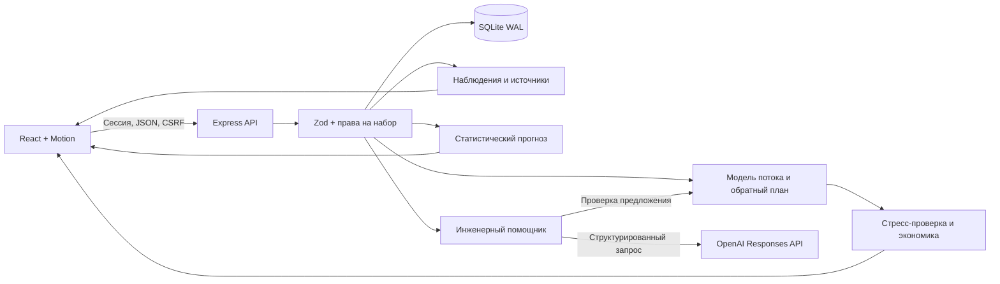

# Архитектура QARQYN

## Один сервер, проверяемые расчёты

React 19 и Motion формируют интерфейс. Vite собирает клиент, Express 5 обслуживает API и production-сборку. Node.js выполняет расчёты, SQLite хранит данные и состояние приложения. Вызов OpenAI необязателен для аналитики, прогноза, сценариев и расчёта эффекта.



| Модуль                          | Ответственность                                                                           |
| ------------------------------- | ----------------------------------------------------------------------------------------- |
| `server/schema.js`              | Схемы набора, записей и запросов; ограничения ссылок и чисел                              |
| `server/analytics.js`           | Наблюдения, отклонения, лимиты восстановления, прямой и обратный расчёт потока            |
| `server/forecast.js`            | Временные ряды, причинная проверка методов, предварительные риски                         |
| `server/forecast-validation.js` | Выбор метода на ранней истории и независимая проверка на отложенном отрезке               |
| `server/flow.js`                | Событийная модель буферов, НЗП, параллельных станков, передела и остановок                |
| `server/action-plan.js`         | Мероприятия с источниками, готовность, частичное выполнение и явные экономические условия |
| `server/engineering.js`         | Версионное хранение инженерных расчётов и передача подтверждённых мероприятий в задачи    |
| `server/impact.js`              | Частичная реализация плана, дополнительный выпуск и введённая экономика                   |
| `server/model-input.js`         | Сопоставимость периодов, полнота наблюдений, классификация простоев                       |
| `server/pilot.js`               | Описательное сравнение реальных наблюдений до и после, проверки сопоставимости            |
| `server/ai.js`                  | Контекст, Responses API, проверка результата, лимиты запросов и бюджета                   |
| `server/app.js`                 | Авторизация, API, принадлежность данных, версии, аудит                                    |
| `server/db.js`                  | SQLite, схема хранения, хеширование и ротация владельца                                   |
| `server/index.js`               | Конфигурация окружения и запуск одного HTTP-процесса                                      |

## Данные и происхождение результата

`data/allur.json` содержит нормализованные таблицы организаторов. ID сохраняют тип записи: P — производство, Q — качество, D — простой, M — месячный план. Набор содержит имя источника и SHA-256. Базовый набор защищён от изменения и удаления через API; редактор импортирует или создаёт рабочую копию через интерфейс.

SQLite хранит набор как проверенный JSON с целочисленной версией. Изменение и удаление требуют текущую версию. Конфликт возвращает `409`. Сохранённый сценарий содержит параметры, пересчитанный результат, версию и хеш набора. Это снимок: правка исходных данных не переписывает старый результат незаметно.

Для участка выпуск, план, рабочие часы, дефекты и простой суммируются по соответствующим записям. Доля брака равна сумме дефектов, делённой на сумму проверенных операций. Выпуск разных участков не складывается в число автомобилей. Отсутствие наблюдений последнего производственного участка оставляет итог неизвестным.

Две даты организаторов дают 240 операций сборки, 18 дефектных операций и 150 минут простоев отдельных машин. Окраска: 10 / 231 = 4,33% брака. Месячный план равен 4800 при цели 5500. Это факты тестового набора, не телеметрия действующего предприятия.

## Стационарная последовательная модель v3

`simulate` возвращает обозначение «Последовательная модель потока v3». Доли брака, рабочее время и границы Уилсона не округляются до вычисления потока; округляется представление результата. Версия проверяет согласованность периодов, применяет выбранную дату ко всем источникам и исключает из восстановления плановые и неклассифицированные события. Ранее сохранённые сценарии остаются неизменными снимками прежних версий; для сравнения с новыми условиями их нужно пересчитать.

Для каждого измеренного производственного участка:

```text
скорость = суммарный выпуск / суммарные рабочие часы
простой на период = сумма минут / число производственных наблюдений
доступное время = горизонт × max(0, 1 − (простой − восстановление) / минуты исходного периода)
ёмкость = скорость × доступное время
годный выход = min(входящий поток, ёмкость) × (1 − брак / 100)
```

Длительность периода исходной строки задаётся пользователем. В примерах используется 8 часов: вводные упоминают двухсменную работу, а отдельные строки содержат до 8 рабочих часов, поэтому длительность строки нельзя незаметно принять за сутки.

Наблюдения качества нужны для каждой пары «производственный участок–дата». Все участки должны покрывать одинаковые даты; требуются одна линия и одна производственная запись на участок и дату, одинаковый заданный режим. Если `periodHours` указан, он должен присутствовать во всех строках и совпадать с выбранным `observationHours`; рабочее время не может превышать период. Несовместимость даёт `422`. Анализ остаётся доступен и возвращает `modelReadiness` с причинами; его предварительная проверка относится к указанным в ответе 8 часам, а расчёт повторяет её для фактического запроса.

`downtime.classification` принимает `planned`, `unplanned`, `unknown`. Явное значение имеет приоритет. Старые однозначные формулировки распознаются ограниченным правилом с указанием основания `legacy-label`; неоднозначная «Замена фильтра» остаётся неизвестной. Восстановлению доступны только внеплановые минуты. `recoveryLimits` возвращает источники каждой категории и использует только записи выбранной даты. Ограничение одинаково в лаборатории, сравнении, обратном плане и предложениях ИИ.

Отсутствующие качество и простой представлены как `null`. `observationCoverage` хранит подтверждение полноты журнала для участка и даты. Только оно позволяет отличить настоящий нулевой простой от отсутствия событий. Если на участке нет ни событий, ни подтверждения полноты, симуляция недоступна. Если события есть, но полнота всех дат не подтверждена, сценарий использует зарегистрированный объём как нижнюю границу потерь и явно сообщает это допущение.

При исходном наборе, горизонте 8 часов и периоде 8 часов базовый поток равен **106,40**. Возврат **12,5 минуты сварки** и целевой брак сварки **2%** дают **109,54**, изменение **+3,14**. Плановое ТО сохранено. Это условный расчёт потока, не подтверждённое увеличение выручки или выпуска.

Модель не включает начальные запасы, очереди, передел, транспортные задержки, разгон, параллельные линии и идентичность автомобилей. Суммарный простой оборудования условно принят потерей времени участка; пересечение остановок неизвестно. Скорость уже получена из исторических данных, поэтому нормализацию и влияние остановок нужно сверить с технологом. Чувствительность к интервалам Уилсона для брака не является доверительным интервалом выпуска.

## Событийный поток и мероприятия

`simulateFlow` — отдельная детерминированная модель последовательного маршрута. Она поддерживает конечные FIFO-буферы, начальный НЗП, одинаковые параллельные станки внутри участка, блокировку после обработки и заданные повторные проходы. Остановки задаются интервалами по станкам; пересечения объединяются, прерванная обработка продолжается после простоя. Результат содержит выпуск, временную шкалу, очередь и состояния станков, а также баланс завершённых деталей, НЗП и неподанных деталей.

Неизвестные параметры не извлекаются из отсутствующих данных: инженер вводит и подтверждает сценарий. Вычисленный из таблиц средний цикл доступен в интерфейсе только как ориентир. Не моделируются списание брака, альтернативные маршруты, наладка и общие транспортные ресурсы. Эта модель не заменяет стационарный обратный план и не добавляет очереди в его формулы автоматически.

`evaluateActionPlan` связывает работу с конкретной записью внеплановой остановки. Одна запись учитывается один раз; восстановление ограничено её длительностью и нормируется по числу исходных наблюдений участка. Название, механизм действия, основание оценки, ответственного, срок, расходы и метод измерения задаёт инженер. Без этих полей и подтверждения план остаётся черновиком. Уверенность инженера не является вероятностью модели и не умножает выпуск.

Выпуск проверяется при полном и частичном выполнении; перенесённая цель сравнивается с частичным результатом. Известные затраты видны отдельно от неуточнённых. Денежный эффект в мероприятиях требует явных маржи, спроса, расходов и источника экономических условий. Это более строгий режим, чем простой калькулятор эффекта, описанный ниже.

При неполных или несопоставимых данных `modelReadiness` объясняет недоступность расчёта. Список реальных остановок и сохранение черновика остаются доступны, показатели выпуска и выгоды возвращаются как `null`. Недостаточная готовность исходных данных блокирует статус готового плана и передачу задач.

`engineering_studies` хранит вход, пересчитанный результат, версию и хеш источника. CRUD проверяет владельца, роль и версии; снимок данных доступен при чтении отдельного расчёта. Передача плана в задачи повторно проверяет исходную версию и готовность. `engineering_dispatches` фиксирует созданные задачи для конкретной версии: повтор запроса возвращает их без дубликатов. Если прежние задачи удалены или недоступны, повтор отклоняется конфликтом. После обновления источника UI снимает старые инженерные подтверждения; правки самих работ тоже требуют повторного подтверждения.

[Параметры, процесс работы и границы моделей](engineering.md).

## Обратный план и эффект

`planTarget` возвращает «Обратное планирование потока v2» и находит покомпонентный минимум восстановления времени при фиксированных скорости и качестве. Достижимость проверяется без преждевременного округления. На исходных данных база **106.39996632996635**, цель **109** требует **11.057477518758162 минуты сварки**; цель **110** выше предела **109.33919191919193**. [Формулы, контракт и ограничения](target-planning.md).

`evaluateImpact` (`impact-v2`) получает этот план и умножает найденные минуты на выбранную пользователем долю реализации. Затем заново считает ограничения каждого участка и итоговый минимум. Доля реализации — сценарное допущение, не вероятность успеха. Результат дополнительно рассчитывается для 0%, 25%, 50%, 75% и 100% реализации.

```text
дополнительный выпуск за период = max(0, новый выпуск − базовый выпуск)
продано за период = min(дополнительный выпуск, введённый предел продаж)
дополнительный маржинальный доход = продано за период × число периодов × вклад единицы
все затраты = стоимость внедрения + регулярные затраты на период × число периодов
эффект после затрат = дополнительный маржинальный доход − все затраты
```

Вклад единицы и стоимость вводит пользователь. Без обоих значений денежный результат остаётся `null`; недостижимая цель также не получает расчётную выгоду. `recurringCostPerPeriod` по умолчанию равен 0, `maxAdditionalSalesPerPeriod` по умолчанию не задан: тогда расчёт условно предполагает продажу всего дополнительного выпуска. ROI делится на сумму разовых и регулярных затрат. Денежный ввод ограничен точностью до двух знаков; нулевые затраты дают `null` для ROI. Недостижимая или численно не представимая окупаемость также остаётся `null`. Налоги и дисконтирование не моделируются.

Экспорт расчёта эффекта сохраняет JSON с входными условиями, версией набора и результатом. Он блокируется при ошибке, недопустимом вводе или незавершённом пересчёте, чтобы не выгрузить результат от прежних значений.

## Статистический прогноз v2

`forecast-v2`: данные группируются по датам отдельно для участка и показателя. Выпуск и зарегистрированные минуты суммируются; качество взвешивается по числу проверенных операций. После последней заданной смены состава линий, `periodHours` или `regime` используется только непрерывная последовательность наблюдений нового режима. Более ранние периоды исключены из прогноза и его текущей проверки; количество исключённых дат показано в `regime`. Неуказанные изменения установить нельзя. Следующий период означает следующее сопоставимое наблюдение, а не автоматически завтрашний день.

Кандидаты: последнее значение, среднее последних трёх наблюдений и линейная экстраполяция последних пяти. Первые три наблюдения используются как начальная история. После пяти последовательных отложенных ошибок можно выбрать метод с меньшей MAE. До этого применяется последнее наблюдение; опубликованная MAE остаётся неизвестной.

Для каждого проверочного шага выбор метода использует ошибки только более ранних шагов. Текущая истинная величина добавляется в оценку методов после фиксации прогноза. Итоговая MAE оценивает всю эту причинную процедуру выбора, а не только лучшего кандидата, выбранного с учётом будущего. Базовый метод проверяется на тех же шагах. Первое сравнение требует минимум 8 наблюдений показателя; этого недостаточно для заявления о промышленной надёжности.

При менее чем 20 проверочных ошибках показываются минимум и максимум наблюдений с соответствующей подписью. Позже доступен диапазон по 90-му процентилю абсолютной ошибки, ограниченный физическими границами. Для каждого следующего проверочного шага границы строятся только из более ранних ошибок; `diagnostics.intervalCoverage` сообщает измеренное прошлое покрытие. Это не гарантия будущей вероятности. Доля брака ограничена 0–100%, значения выпуска и минут неотрицательны.

`diagnostics` также показывает полноту наблюдений, последнюю дату, календарные разрывы и сравнение MAE последних пяти шагов с предыдущими пятью. Рост больше чем в 1,5 раза даёт эвристический сигнал для проверки. Это не статистическое доказательство дрейфа. Календарный разрыв не доказывает пропущенную рабочую смену без производственного календаря.

Ответ содержит полную статистику, источники, до 180 последних точек и до 80 последних проверочных шагов с явными признаками усечения. API кеширует до 24 результатов по ID и версии набора; права проверяются до обращения к кешу.

В исходном журнале нет подтверждения периодов без событий. Поэтому прогноз минут условен для периода с зарегистрированным событием. В рабочей копии подтверждённая дата с `downtimeComplete:true` и без событий становится явным нулевым наблюдением участка, со ссылкой на подтверждение. История отдельного оборудования при этом не выдумывается. Вероятность отказа и суммарный простой линии не вычисляются. На двух исходных датах результат предварительный, подтверждённая точность отсутствует.

## Независимая проверка прогноза

`validateForecast` (`forecast-validation-v1`) отделяет выбор метода от контрольного отрезка. Для первого сравнения нужны минимум 16 сопоставимых наблюдений: не менее восьми ранних и восьми контрольных. Откладываются последние 25%, но не менее восьми. На ранней истории выбирается один метод, затем на всём контрольном отрезке он фиксирован; каждый шаг использует только уже известные факты.

Отчёт показывает MAE, RMSE, результат простой базы, парные ошибки и четыре временных блока. При минимум 20 контрольных наблюдениях выполняется 500 блочных перепроверок разницы ошибок. Статус `better` требует подтверждённой сопоставимости, снижения MAE минимум на 5%, выигрыша в трёх из четырёх блоков и положительного нижнего 5-го процентиля перепроверки. Это внутреннее правило допуска к пилоту, не гарантия будущей точности и не доказательство по всем показателям сразу.

Требуются явные длительности периодов, полная история показателя и равные интервалы наблюдений; для простоев — подтверждение полного журнала за каждую дату. На двух датах Allur измеренная точность не выдумывается. Этот модуль проверяет величину показателя следующего периода, а не вероятность или причину отказа. При изменении набора граница проверки пересчитывается; JSON-экспорт фиксирует версию и полный отчёт.

## Проверка наблюдений до и после

`evaluatePilot` (`pilot-review-v1`) получает один участок, непересекающиеся списки дат `beforeDates` и `afterDates`, ID и ожидаемую версию набора. Все даты «после» должны идти позже всех дат «до». У каждой выбранной даты должно существовать производство участка; повторения и неизвестные даты отклоняются.

Сравнение требует одну и ту же линию, одну строку на дату, явно заданные одинаковые `periodHours` и `regime`. Если это не подтверждено, возвращаются фактические показатели обеих сторон и причины, но `delta:null`. Для качества дополнительно нужны проверки за все выбранные даты; для среднего простоя — явное подтверждение полноты журнала за все даты. Производственная сопоставимость и готовность отдельных показателей отражаются раздельно.

Возвращаются выпуск на период, выпуск на зарегистрированный рабочий час, взвешенная доля брака и минуты оборудования на период, а также источники и подтверждения полноты. Это описательное сравнение: одна дата не даёт оценки устойчивости, а даже большая история сама по себе не доказывает причинность. Финансовая экономия, статистическая значимость и доверительный интервал эффекта не заявляются. Наличие этого инструмента не означает, что промышленный пилот проведён.

Методологическая основа: [простые методы](https://otexts.com/fpp3/simple-methods.html), [rolling-origin](https://otexts.com/fpp3/tscv.html), [интервалы](https://otexts.com/fpp3/prediction-intervals.html). Размеры окон и технические пороги — явные настройки этой реализации.

## Инженерный помощник

Контекст включает вопрос, ограниченную историю диалога, проверенные записи, наблюдения, допустимое восстановление и компактную сводку прогноза. OpenAI возвращает JSON по строгой схеме. Сервер проверяет ID источников, участки, лимиты времени и структуру, затем самостоятельно пересчитывает сценарий. Ответ не выполняет SQL, команды или изменения данных.

История диалога передаётся как недоверенный контекст. Существующий ID подтверждает наличие записи, но не истинность каждой фразы модели. Сохранение результата требует действия пользователя и проверки актуальности версии набора. Вопрос и данные выбранного набора передаются внешнему провайдеру с `store: false`; политика обращения с реальными конфиденциальными данными согласуется до интеграции.

На пользователя разрешён один одновременный ИИ-запрос. До отправки резервируется консервативная стоимость; после ответа учитываются токены по настроенным тарифам. Таймаут не запускает автоматический платный повтор. Внутренний бюджет не равен балансу OpenAI.

## API

Все маршруты имеют префикс `/api`. Кроме health и начала сессии требуется действующая сессия. Для POST/PUT/DELETE проверяются Origin, JSON и CSRF; вход и гостевой вход исключены из требования уже существующего CSRF.

| Маршрут                                                       | Назначение                                 | Дополнительные условия                                                            |
| ------------------------------------------------------------- | ------------------------------------------ | --------------------------------------------------------------------------------- |
| `GET /health`                                                 | Проверка процесса                          | Без сессии                                                                        |
| `POST /auth/demo`, `POST /auth/login`                         | Гостевой вход / вход владельца             | Ограничение частоты                                                               |
| `GET /session`, `POST /auth/logout`                           | Состояние / завершение сессии              | Действующая сессия                                                                |
| `GET /datasets`, `GET /datasets/:id`                          | Наборы и содержимое                        | Права на набор                                                                    |
| `POST /datasets`                                              | Импорт или рабочая копия                   | Редактор/администратор                                                            |
| `PUT`, `DELETE /datasets/:id`                                 | Изменение / удаление                       | Роль, принадлежность, версия; исходный набор защищён                              |
| `GET /analysis/:id`                                           | Показатели и исходные записи               | Права на набор; необязательная дата                                               |
| `GET /forecast/:id`                                           | Статистический прогноз и проверка          | Права на набор                                                                    |
| `GET /forecast-validation/:id`                                | Независимая проверка на отложенной истории | Права на набор; кеш по ID и версии; ограничение частоты                           |
| `POST /flow-simulate`                                         | Событийный поток                           | Права, актуальная версия, явное подтверждение параметров                          |
| `POST /action-plan/evaluate`                                  | Проверка мероприятий и эффекта             | Права, версия, ограничения реальных остановок                                     |
| `GET`, `POST /flow-studies`, `/action-plans`                  | Списки и сохранение инженерных расчётов    | Списки с пагинацией; запись требует роли редактора/администратора                 |
| `GET`, `PUT`, `DELETE /flow-studies/:id`, `/action-plans/:id` | Чтение, изменение, удаление                | Владение; версия для изменения/удаления; снимок источника при чтении              |
| `POST /action-plans/:id/tasks`                                | Передача мероприятий в задачи              | Актуальные версии плана и данных, инженерная готовность; без дублей той же версии |
| `POST /simulate`, `POST /optimize`                            | Прямой расчёт / сравнение                  | Права на набор; границы восстановления                                            |
| `POST /plan-target`                                           | Обратное планирование                      | Права на набор; 30 запросов в минуту                                              |
| `POST /impact`                                                | Частичная реализация и экономика           | Права на набор; `expectedDatasetVersion` обязателен                               |
| `POST /pilot`                                                 | Сравнение реальных наблюдений до/после     | Права на набор, обязательная версия, сопоставимость периодов                      |
| `GET`, `POST /incidents`                                      | Список / создание событий                  | Чтение в своей области, запись по роли                                            |
| `PUT`, `DELETE /incidents/:id`                                | Изменение / удаление события               | Принадлежность и версия                                                           |
| `GET`, `POST /scenarios`                                      | Список / сохранение сценариев              | Чтение в своей области, запись по роли                                            |
| `PUT`, `DELETE /scenarios/:id`                                | Изменение / удаление сценария              | Принадлежность и версия                                                           |
| `GET /export/:id`                                             | CSV показателей                            | Права на набор                                                                    |
| `GET /audit`                                                  | Журнал изменений                           | Администратор                                                                     |
| `POST /assistant`                                             | Внешний ИИ                                 | Редактор/администратор, настроенный провайдер, лимиты                             |

## Защита и эксплуатация

Пароли хешируются scrypt с индивидуальной солью. Cookie имеет HttpOnly, SameSite=Strict и Secure при HTTPS; в базе хранится хеш токена. При смене параметров владельца в окружении и перезапуске учётная запись обновляется, прежние сессии владельца удаляются, событие попадает в аудит.

API проверяет Host, Origin, CSRF, роль и принадлежность. Zod отклоняет неожиданные поля, неверные даты, ссылки и значения. SQL использует подготовленные параметры; динамические имена таблиц выбираются из фиксированного списка. CSP ограничивает внешние источники. CSV экранирует формульные префиксы. Ошибка сервера не отдаёт стек клиенту.

Перед промышленным размещением нужны корпоративная схема доступа и управления пользователями, проверенные интеграции, HTTPS, резервное копирование с проверкой восстановления, централизованный мониторинг, политика хранения данных и нагрузочное испытание. Система не отправляет команды оборудованию.

## Как проверить внедрение

1. Согласовать определения периода, выпуска и дефекта, полноту журналов, маршруты и взаимное перекрытие остановок.
2. Загрузить реальную историю; сравнить причинную ошибку прогноза с базовым методом по участкам и режимам.
3. До изменения процесса зафиксировать цель, допустимые вмешательства, затраты и способ измерения результата.
4. Выполнить контролируемый пилот с технологом, сопоставить сопоставимые периоды и отдельно учесть спрос, смену моделей и другие изменения.
5. Сопоставить измеренный результат с расчётом; только после этого заявлять производственный и финансовый эффект.

Источник требований: [кейс № 2 Allur](https://drive.google.com/file/d/1VQM_DD7e4ecX8FRukZEB35kOjtetoHQB/view). Данные: [материалы организаторов](https://docs.google.com/document/d/1HKx1j3UIkkIZknEoKKMEQBksqWpYpaW5/edit).
